Class 5 - Data Exploration and Visualization in R
================
Vicky Vu
2/8/2020

Section 1: Getting Set Up

Download the ZIP file containing all the input data for this lab and put
into the folder created for this class. The data should be seen in the
files section.

\#Section 2: Customizing Plots

\#\#2A : Line Plot

We’ll start by using the plot() function on weight\_chart.txt You can
click on the file to view its contents.

Q: how are the records separated? Space Q: (T/F) The file has a header.
TRUE

``` r
w <- read.table( "bimm143_05_rstats/weight_chart.txt", header = TRUE)
w
```

    ##    Age Weight
    ## 1    0    3.6
    ## 2    1    4.4
    ## 3    2    5.2
    ## 4    3    6.0
    ## 5    4    6.6
    ## 6    5    7.2
    ## 7    6    7.8
    ## 8    7    8.4
    ## 9    8    8.8
    ## 10   9    9.2

Here we have to specify where the file is within our working file.

Now we will use the plot() function to plot this data as a point and
line graph with various customizations.

We can plot () using the whole read.table function:

``` r
plot ( w )
```

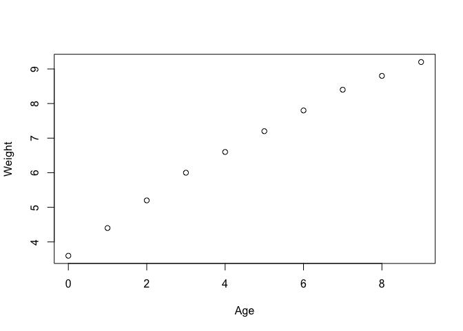<!-- -->
To change a scatter plot to a line plot, specify a type argument.

``` r
plot (w, type = "o")
```

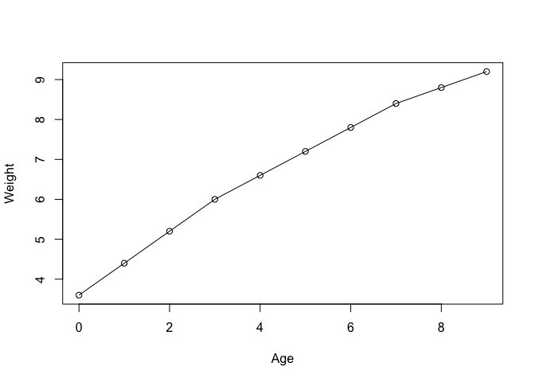<!-- -->
To change the point character to be a square. Use pch.

``` r
plot ( w, type = "o", pch = 15)
```

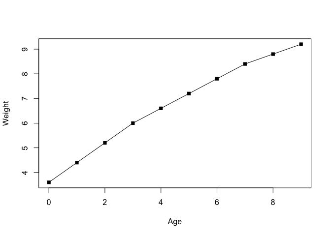<!-- -->

What argument changes the plot point size to be 1.5x normal size?

``` r
plot ( w, type = "o", pch = 15, cex = 1.5)
```

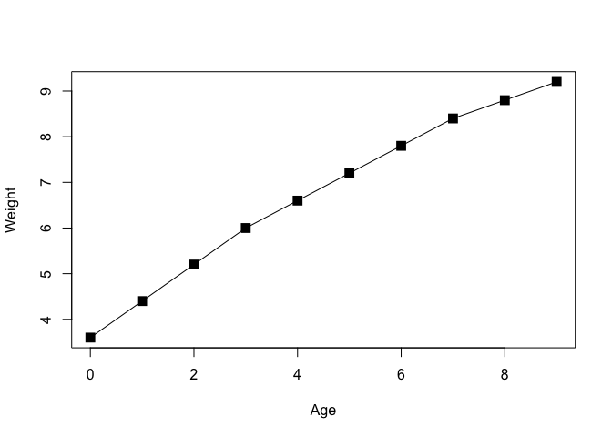<!-- -->
What argument changes the line width thickness to be twice the default
size?

``` r
plot ( w, type = "o", pch = 15, cex = 1.5, lwd = 2)
```

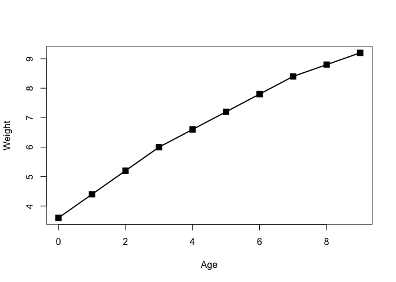<!-- -->

What argument changes the y-axis limits to scale between 2 and 10kg?

``` r
plot ( w, type = "o", pch = 15, cex = 1.5, lwd = 2, ylim = c(2,10))
```

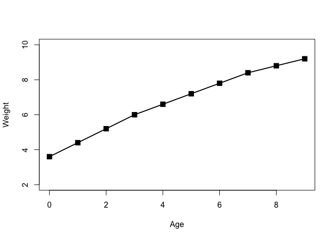<!-- -->
What argument add a suitable title to the top of the
plot?

``` r
plot ( w, type = "o", pch = 15, cex = 1.5, lwd = 2, ylim = c(2,10), main = "Age V. Weight")
```

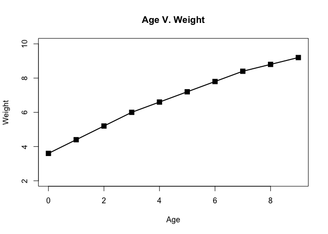<!-- -->
What argument changes the x-axis label to be Age (months) and the y-
axis to be weight
(kg)

``` r
plot ( w, type = "o", pch = 15, cex = 1.5, lwd = 2, ylim = c(2,10), main = "Age V. Weight", xlab = "Age (months)", ylab = "Weight (kg)")
```

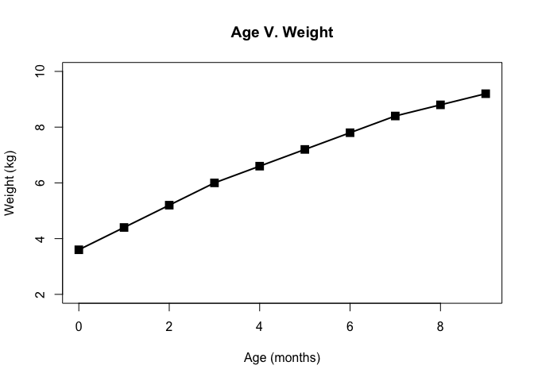<!-- -->

## 2B: Barplot

The file feature\_counts.txt contains a summary of features of different
types in the mouse GRCm38
genome.

``` r
mouse <- read.table("bimm143_05_rstats/feature_counts.txt", sep="\t", header=TRUE)
```

For the barplot, we want to plot the values for Count, not the names.

``` r
barplot ( mouse$Count )
```

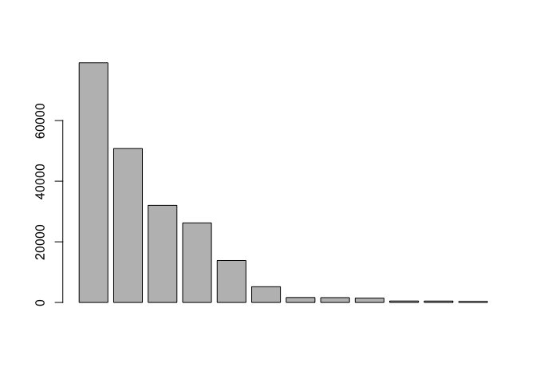<!-- -->
Once you have the basic plot above make the following changes:

The bars should be horizontal rather than vertical.

The feature names should be added to the y axis. (set names.arg to the
Feature column of the data frame).

``` r
barplot ( mouse$Count, names.arg = "Feature")
```

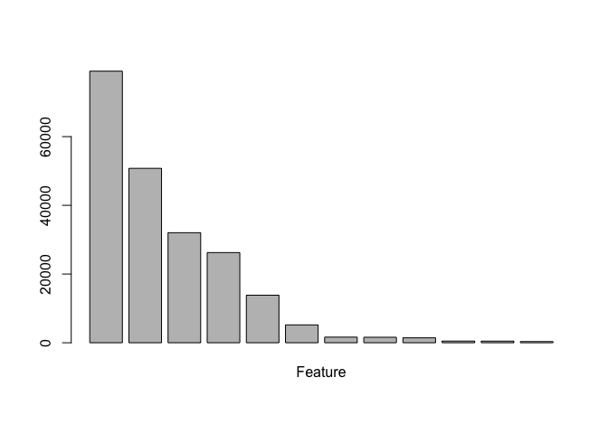<!-- -->

The plot should be given a suitable title.

The text labels should all be horizontal. Note that this parameter
(along with many, many others) is documented in the par() function help
page (i.e. see ?par). What parameter setting should you use here?

The margins should be adjusted to accommodate the labels (par mar
parameter). You need to supply a 4 element vector for the bottom, left,
top and right margin values.

horiz = TRUE aregues that we want the barplot to be
horizontal.

``` r
par(mar=c(3.1, 11.1, 4.1, 2)) # tells us how much space for the bottom, left, top, right

barplot(mouse$Count, names.arg=mouse$Feature, 
        horiz=TRUE, ylab="", 
        main="Number of features in the mouse GRCm38 genome", 
        las=1, xlim=c(0,80000))
```

<!-- -->

## 2C: Histograms

Use this hist() function to plot out the distribution of 10000 points
sampled from a standard normal distribution (use the rnorm() function)
along with another 10000 points sampled from the same distribution but
with an offset of 4.

``` r
hist ( c(rnorm(1000), rnorm(1000)+4), breaks = 50)
```

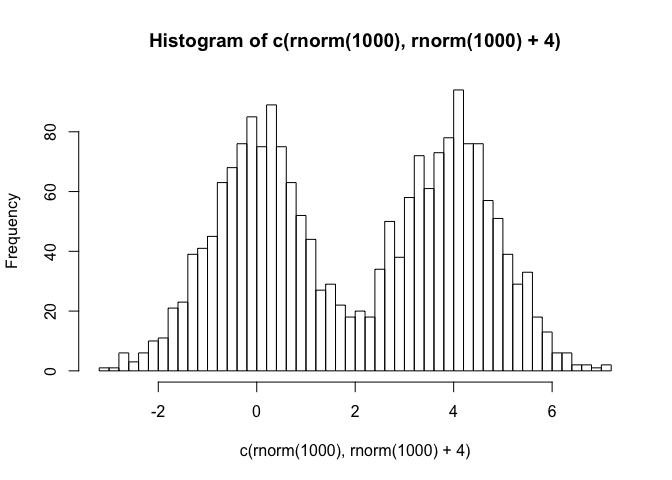<!-- -->

# Section 3: Using color in plots

The file male\_female\_counts.txt contains a time series split into male
and female count values.

Plot this as a barplot

Make all bars different colors using the rainbow()
function.

``` r
counts <- read.table("bimm143_05_rstats/male_female_counts.txt", header=TRUE, sep="\t")
barplot(counts$Count, names.arg = counts$Sample, col=rainbow(nrow(counts)))
```

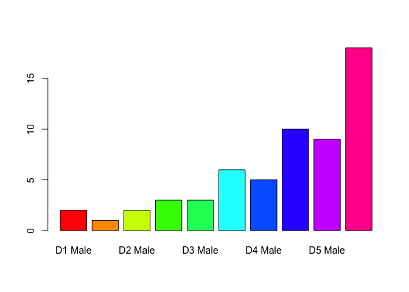<!-- -->

``` r
barplot(counts$Count, names.arg = counts$Sample, col=c( "blue", "red"), ylab = "Counts")
```

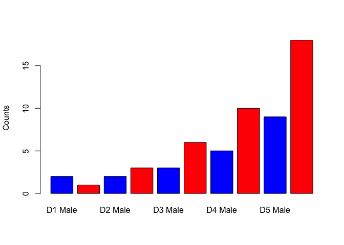<!-- -->

## 3B: Coloring by value
