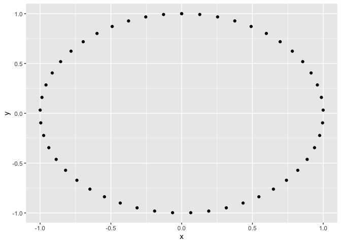
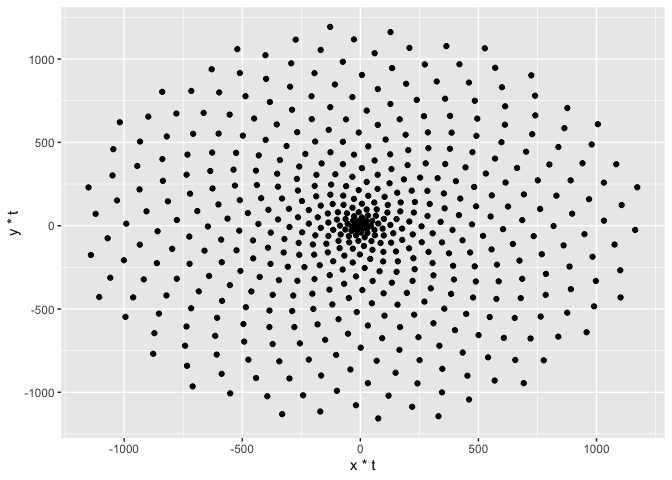
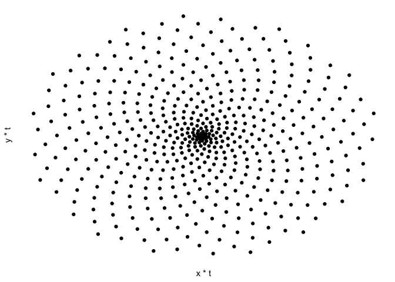
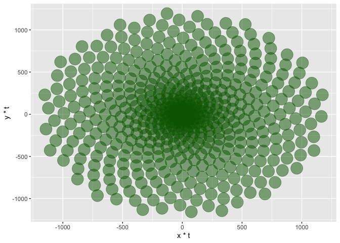
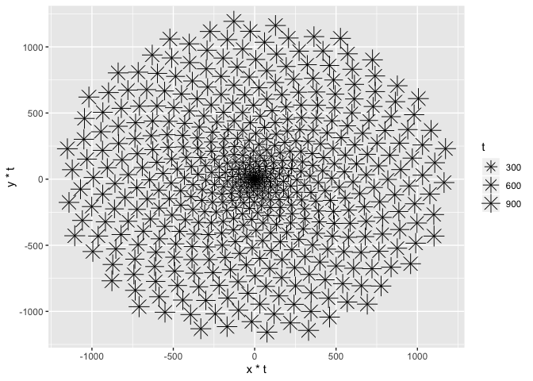
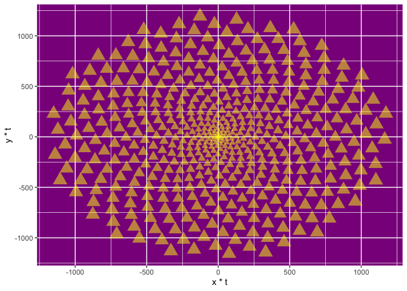

PHYLLOTAXIS - Draw Flowers using Math
================

# Patterns in Nature

Thereare many examples of natural facts that can be described in
mathematical terms. Nice examples are the shape of snowflakes, the
fractal geometry of romanesco broccoli or how self-similarity rules the
growth of plants.

R is a tool for doing serious analysis, but not everything in life is
serious. Life is also funny, and R can be used to have fun and to do
beautiful things. Its graphical power can be used to produce artistic
images like the one that illustrates this section, which is inspired by
how plants arrange their leaves. This fact is called phyllotaxis and
will serve as the basis of this project.

``` r
library(ggplot2)
```

There are many ways to represent data with ggplot2: from simple scatter
plots to more complex violin plots. The functions that start with geom\_
define the type of plot. In this notebook, we will only work with
geom\_point() which plots points in two dimensions. We’ll need a dataset
with two variables; let’s call them x and y.

We’ll start by drawing 50 points on a circle of radius 1. As every (x,
y) point should be in the unit circle, it follows that x² + y² = 1. We
can get this using the super famous Pythagorean trigonometric identity
which states that sin²(θ) + cos²(θ) = 1 for any real number θ.

``` r
# Create circle data to plot
t <- seq(0, 2*pi, length.out = 50)
x <- sin(t)
y <- cos(t)
df <- data.frame(t, x, y)

# Make a scatter plot of points in a circle
p <- ggplot(df, aes(x, y))
p + geom_point()
```

<!-- -->

## Create a scatter plot of spiralized plots

``` r
# Define the number of points
points <- 500

# Define the Golden Angle

angle <- pi * (3 - sqrt(5))

t <- (1:points) * angle
x <- sin(t)
y <-cos(t)
df <- data.frame(t, x, y)

# Make a scatter plot of points in a spiral
p <- ggplot(df, aes(x*t, y*t))
p + geom_point()
```

<!-- --> Remove
everything unnecessary

``` r
df <- data.frame(t, x, y)

# Make a scatter plot of points in a spiral and remove some plot components
p <- ggplot(df, aes(x*t, y*t))
p + geom_point() +
# .... YOUR CODE FOR TASK 4 ....
 theme(panel.background = element_rect(fill="white"),
        axis.text=element_blank(), axis.ticks = element_blank())
```

<!-- -->

``` r
# Change the code from Task 4 to modify the 
# size, transparency, and color of the points
p <- ggplot(df, aes(x*t, y*t))
p + geom_point(size = 8, alpha = 0.5, color = "darkgreen") 
```

<!-- -->

``` r
# Copy the code from Task 5 and modify the 
# color, size, and shape of the points
p <- ggplot(df, aes(x*t, y*t))
p +  geom_point (aes(size=t),shape = 8 )
```

<!-- -->

``` r
theme(legend.position = "none")
```

    ## List of 1
    ##  $ legend.position: chr "none"
    ##  - attr(*, "class")= chr [1:2] "theme" "gg"
    ##  - attr(*, "complete")= logi FALSE
    ##  - attr(*, "validate")= logi TRUE

## Put it all together: the sunflower

``` r
p <- ggplot(df, aes(x*t, y*t))
p + geom_point(aes(size=t), alpha=0.5, shape=17, color="yellow") +
    theme(legend.position="none",
          panel.background = element_rect(fill="darkmagenta"))
```

<!-- -->
