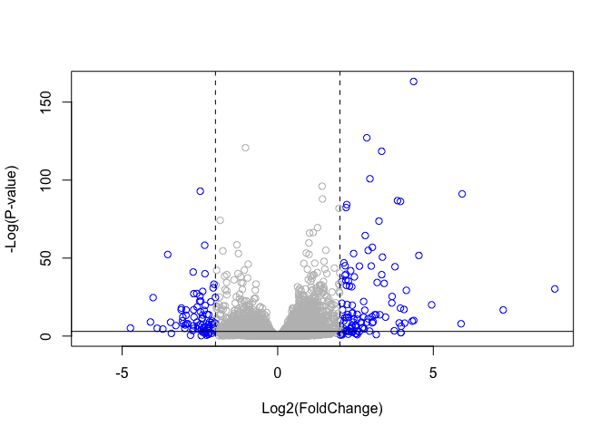

Class 14: Transcriptomics and the Analysis of RNA- Seq data
================
Vicky Vu
2/20/2020

\#\#Import countData and colData from the class website. The data for
this hands-on session comes from a published RNA-seq experiment where
airway smooth muscle cells were treated with dexamethasone, a synthetic
glucocorticoid steroid with anti-inflammatory effects (Himes et
al. 2014).

Glucocorticoids are used, for example, by people with asthma to reduce
inflammation of the airways. The anti-inflammatory effects on airway
smooth muscle (ASM) cells has been known for some time but the
underlying molecular mechanisms are
unclear.

``` r
counts <- read.csv("data/airway_scaledcounts.csv", stringsAsFactors = FALSE)
metadata <-  read.csv("data/airway_metadata.csv", stringsAsFactors = FALSE)
```

Now take a look at
    each.

``` r
head(counts)
```

    ##           ensgene SRR1039508 SRR1039509 SRR1039512 SRR1039513 SRR1039516
    ## 1 ENSG00000000003        723        486        904        445       1170
    ## 2 ENSG00000000005          0          0          0          0          0
    ## 3 ENSG00000000419        467        523        616        371        582
    ## 4 ENSG00000000457        347        258        364        237        318
    ## 5 ENSG00000000460         96         81         73         66        118
    ## 6 ENSG00000000938          0          0          1          0          2
    ##   SRR1039517 SRR1039520 SRR1039521
    ## 1       1097        806        604
    ## 2          0          0          0
    ## 3        781        417        509
    ## 4        447        330        324
    ## 5         94        102         74
    ## 6          0          0          0

``` r
head(metadata)
```

    ##           id     dex celltype     geo_id
    ## 1 SRR1039508 control   N61311 GSM1275862
    ## 2 SRR1039509 treated   N61311 GSM1275863
    ## 3 SRR1039512 control  N052611 GSM1275866
    ## 4 SRR1039513 treated  N052611 GSM1275867
    ## 5 SRR1039516 control  N080611 GSM1275870
    ## 6 SRR1039517 treated  N080611 GSM1275871

How many genes are we dealing with?

``` r
nrow(counts)
```

    ## [1] 38694

We want to calculate the average counts per gene for control samples and
for the drug treated samples. We will then compare these calies to see
if there is a differnce overall between control and treted samples for a
given gene.

This is our metadata info that tells me where our control and treated
samples are. (i.e which colums in ‘counts’)

## Toy Differential gene expression

To access the control only rows in the metadata

``` r
#metadata$dex == "control"

#this line of code gives of the id of the control
control <- metadata[metadata$dex == "control",]
#metadata$id[metadata$dex == "control"] is also acceptable
control
```

    ##           id     dex celltype     geo_id
    ## 1 SRR1039508 control   N61311 GSM1275862
    ## 3 SRR1039512 control  N052611 GSM1275866
    ## 5 SRR1039516 control  N080611 GSM1275870
    ## 7 SRR1039520 control  N061011 GSM1275874

Now use the $id of the control data to access the control colums in
‘counts’ and calculat the average.

``` r
control.mean <- rowSums( counts[ ,control$id] ) / nrow(control)
names(control.mean) <- counts$ensgene
```

Now let’s do the same for the “treated” samples.

``` r
treated <- metadata[metadata$dex == "treated",]
treated
```

    ##           id     dex celltype     geo_id
    ## 2 SRR1039509 treated   N61311 GSM1275863
    ## 4 SRR1039513 treated  N052611 GSM1275867
    ## 6 SRR1039517 treated  N080611 GSM1275871
    ## 8 SRR1039521 treated  N061011 GSM1275875

``` r
treated.mean <- rowSums( counts[,treated$id] ) / nrow(treated)
```

we will combine out meancount data for bookkeeping
    purposes.

``` r
meancounts <- data.frame(control.mean, treated.mean)
```

Plotting

``` r
plot (meancounts, log = "xy" )
```

    ## Warning in xy.coords(x, y, xlabel, ylabel, log): 15032 x values <= 0 omitted
    ## from logarithmic plot

    ## Warning in xy.coords(x, y, xlabel, ylabel, log): 15281 y values <= 0 omitted
    ## from logarithmic plot

<!-- -->

We can find candidate differentially expressed genes by looking for
genes with a large change between control and dex-treated samples. We
usually look at the log2 of the fold change, because this has better
mathematical properties.

Here we calculate
log2foldchange

``` r
meancounts$log2fc <- log2(meancounts[,"treated.mean"]/meancounts[,"control.mean"])

head(meancounts)
```

    ##                 control.mean treated.mean      log2fc
    ## ENSG00000000003       900.75       658.00 -0.45303916
    ## ENSG00000000005         0.00         0.00         NaN
    ## ENSG00000000419       520.50       546.00  0.06900279
    ## ENSG00000000457       339.75       316.50 -0.10226805
    ## ENSG00000000460        97.25        78.75 -0.30441833
    ## ENSG00000000938         0.75         0.00        -Inf

Remove any gene that has zero average counts.

``` r
zero.vals <- which(meancounts[,1:2]==0, arr.ind=TRUE)

to.rm <- unique(zero.vals[,1])
mycounts <- meancounts[-to.rm,]
head(mycounts)
```

    ##                 control.mean treated.mean      log2fc
    ## ENSG00000000003       900.75       658.00 -0.45303916
    ## ENSG00000000419       520.50       546.00  0.06900279
    ## ENSG00000000457       339.75       316.50 -0.10226805
    ## ENSG00000000460        97.25        78.75 -0.30441833
    ## ENSG00000000971      5219.00      6687.50  0.35769358
    ## ENSG00000001036      2327.00      1785.75 -0.38194109

how many genes do I have left?

``` r
nrow(mycounts)
```

    ## [1] 21817

A common threshold used for calling something differentially expressed
is a log2(FoldChange) of greater than 2 or less than -2. Let’s filter
the dataset both ways to see how many genes are up or down-regulated.

``` r
up.ind <- mycounts$log2fc > 2
down.ind <- mycounts$log2fc < (-2)
```

``` r
sum(up.ind)
```

    ## [1] 250

``` r
sum ( down.ind)
```

    ## [1] 367

## Adding annotation data

## Do this properly with DESeq2 Analysis

DESeq2 is an R package for analyzing count-based NGS data like RNA-seq.
It is available from Bioconductor. Bioconductor is a project to provide
tools for analyzing high-throughput genomic data including RNA-seq,
ChIP-seq and arrays.

``` r
library( DESeq2)
```

    ## Loading required package: S4Vectors

    ## Loading required package: stats4

    ## Loading required package: BiocGenerics

    ## Loading required package: parallel

    ## 
    ## Attaching package: 'BiocGenerics'

    ## The following objects are masked from 'package:parallel':
    ## 
    ##     clusterApply, clusterApplyLB, clusterCall, clusterEvalQ,
    ##     clusterExport, clusterMap, parApply, parCapply, parLapply,
    ##     parLapplyLB, parRapply, parSapply, parSapplyLB

    ## The following objects are masked from 'package:stats':
    ## 
    ##     IQR, mad, sd, var, xtabs

    ## The following objects are masked from 'package:base':
    ## 
    ##     anyDuplicated, append, as.data.frame, basename, cbind, colnames,
    ##     dirname, do.call, duplicated, eval, evalq, Filter, Find, get, grep,
    ##     grepl, intersect, is.unsorted, lapply, Map, mapply, match, mget,
    ##     order, paste, pmax, pmax.int, pmin, pmin.int, Position, rank,
    ##     rbind, Reduce, rownames, sapply, setdiff, sort, table, tapply,
    ##     union, unique, unsplit, which, which.max, which.min

    ## 
    ## Attaching package: 'S4Vectors'

    ## The following object is masked from 'package:base':
    ## 
    ##     expand.grid

    ## Loading required package: IRanges

    ## Loading required package: GenomicRanges

    ## Loading required package: GenomeInfoDb

    ## Loading required package: SummarizedExperiment

    ## Loading required package: Biobase

    ## Welcome to Bioconductor
    ## 
    ##     Vignettes contain introductory material; view with
    ##     'browseVignettes()'. To cite Bioconductor, see
    ##     'citation("Biobase")', and for packages 'citation("pkgname")'.

    ## Loading required package: DelayedArray

    ## Loading required package: matrixStats

    ## 
    ## Attaching package: 'matrixStats'

    ## The following objects are masked from 'package:Biobase':
    ## 
    ##     anyMissing, rowMedians

    ## Loading required package: BiocParallel

    ## 
    ## Attaching package: 'DelayedArray'

    ## The following objects are masked from 'package:matrixStats':
    ## 
    ##     colMaxs, colMins, colRanges, rowMaxs, rowMins, rowRanges

    ## The following objects are masked from 'package:base':
    ## 
    ##     aperm, apply, rowsum

``` r
citation("DESeq2")
```

    ## 
    ##   Love, M.I., Huber, W., Anders, S. Moderated estimation of fold change
    ##   and dispersion for RNA-seq data with DESeq2 Genome Biology 15(12):550
    ##   (2014)
    ## 
    ## A BibTeX entry for LaTeX users is
    ## 
    ##   @Article{,
    ##     title = {Moderated estimation of fold change and dispersion for RNA-seq data with DESeq2},
    ##     author = {Michael I. Love and Wolfgang Huber and Simon Anders},
    ##     year = {2014},
    ##     journal = {Genome Biology},
    ##     doi = {10.1186/s13059-014-0550-8},
    ##     volume = {15},
    ##     issue = {12},
    ##     pages = {550},
    ##   }

Setup input of for DESeq for specifying countadata, metadata, and the
design ( i.e. which comparasions we are interested in)

``` r
dds <- DESeqDataSetFromMatrix(countData=counts, 
                              colData=metadata, 
                              design=~dex, 
                              tidy=TRUE)
```

    ## converting counts to integer mode

    ## Warning in DESeqDataSet(se, design = design, ignoreRank): some variables in
    ## design formula are characters, converting to factors

``` r
dds
```

    ## class: DESeqDataSet 
    ## dim: 38694 8 
    ## metadata(1): version
    ## assays(1): counts
    ## rownames(38694): ENSG00000000003 ENSG00000000005 ... ENSG00000283120
    ##   ENSG00000283123
    ## rowData names(0):
    ## colnames(8): SRR1039508 SRR1039509 ... SRR1039520 SRR1039521
    ## colData names(4): id dex celltype geo_id

DESeq pipeline

Next, let’s run the DESeq pipeline on the dataset, and reassign the
resulting object back to the same variable.

``` r
dds <- DESeq (dds)
```

    ## estimating size factors

    ## estimating dispersions

    ## gene-wise dispersion estimates

    ## mean-dispersion relationship

    ## final dispersion estimates

    ## fitting model and testing

``` r
res <- results (dds)
```

``` r
summary (res)
```

    ## 
    ## out of 25258 with nonzero total read count
    ## adjusted p-value < 0.1
    ## LFC > 0 (up)       : 1563, 6.2%
    ## LFC < 0 (down)     : 1188, 4.7%
    ## outliers [1]       : 142, 0.56%
    ## low counts [2]     : 9971, 39%
    ## (mean count < 10)
    ## [1] see 'cooksCutoff' argument of ?results
    ## [2] see 'independentFiltering' argument of ?results

``` r
resOrdered<- res[order(res$pvalue),] #this orders theresult by the smallest p-value 
```

The results function contains a number of arguments to customize the
results table. By default the argument alpha is set to 0.1. If the
adjusted p value cutoff will be a value other than 0.1, alpha should be
set to that value:

``` r
res05 <- results(dds, alpha=0.05)
summary(res05)
```

    ## 
    ## out of 25258 with nonzero total read count
    ## adjusted p-value < 0.05
    ## LFC > 0 (up)       : 1236, 4.9%
    ## LFC < 0 (down)     : 933, 3.7%
    ## outliers [1]       : 142, 0.56%
    ## low counts [2]     : 9033, 36%
    ## (mean count < 6)
    ## [1] see 'cooksCutoff' argument of ?results
    ## [2] see 'independentFiltering' argument of ?results

``` r
resSig05 <- subset(as.data.frame(res), padj < 0.05)
nrow(resSig05)
```

    ## [1] 2181

``` r
head(resSig05)
```

    ##                  baseMean log2FoldChange      lfcSE      stat       pvalue
    ## ENSG00000002834 8609.1828      0.4168751 0.10829698  3.849369 1.184225e-04
    ## ENSG00000003096  414.0753     -0.9645786 0.19174190 -5.030609 4.889233e-07
    ## ENSG00000003402 3368.7234      1.1624996 0.12613859  9.216050 3.082471e-20
    ## ENSG00000004059 1684.3218      0.3796898 0.11419425  3.324946 8.843554e-04
    ## ENSG00000004487 1255.8003     -0.3341055 0.09603837 -3.478875 5.035225e-04
    ## ENSG00000004700 1510.2085      0.4095533 0.11916233  3.436936 5.883348e-04
    ##                         padj
    ## ENSG00000002834 1.830111e-03
    ## ENSG00000003096 1.492892e-05
    ## ENSG00000003402 7.912546e-18
    ## ENSG00000004059 9.410395e-03
    ## ENSG00000004487 6.028338e-03
    ## ENSG00000004700 6.772115e-03

``` r
ord <- order ( resSig05$padj)
head ( resSig05 [ord,])
```

    ##                   baseMean log2FoldChange      lfcSE      stat       pvalue
    ## ENSG00000152583   954.7709       4.368359 0.23712679  18.42204 8.744898e-76
    ## ENSG00000179094   743.2527       2.863889 0.17556931  16.31201 8.107836e-60
    ## ENSG00000116584  2277.9135      -1.034701 0.06509844 -15.89440 6.928546e-57
    ## ENSG00000189221  2383.7537       3.341544 0.21240579  15.73189 9.144326e-56
    ## ENSG00000120129  3440.7038       2.965211 0.20369513  14.55710 5.264243e-48
    ## ENSG00000148175 13493.9204       1.427168 0.10038904  14.21638 7.251278e-46
    ##                         padj
    ## ENSG00000152583 1.324415e-71
    ## ENSG00000179094 6.139658e-56
    ## ENSG00000116584 3.497761e-53
    ## ENSG00000189221 3.462270e-52
    ## ENSG00000120129 1.594539e-44
    ## ENSG00000148175 1.830344e-42

## Data Visualization

Volcano Plots

``` r
mycols <- rep("gray", nrow(res))
mycols[res$log2FoldChange > 2] <- "blue"
mycols[res$log2FoldChange < -2] <- "blue"


plot( res$log2FoldChange,  -log(res$padj), col = mycols, ylab="-Log(P-value)", xlab="Log2(FoldChange)")

abline ( v= c(2,-2), lty=2)
abline (h=-log(0.05))
```

<!-- -->
